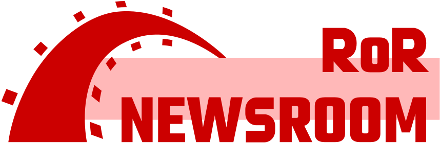

# RoR Newsroom

## TOC

- About
- How to install (on local system) *requires GitHub OAuth
- Contributor's guide
- License

## About RoR Newsroom

RoR Newsroom as a platform focuses on the publishing workflow found in a multi-person, news-producing venture. Since this is a school project, I kept the workflow and the authorizations very simple. There are anonymous users (without accounts), and employees( those with accounts). I am using the following workflow to model the behavior of RoR Newsroom:

1. New idea or a pitch
2. Approval to proceed
3. Assignment of an idea to an author
4. Working draft
5. Editorial review of draft (and sent back to step 4 if revisions are needed)
6. Publish live news article
7. The platform also allows for updates to be attached to published articles.

## How to install (on local system)

1. Download or clone this repo.
2. Open terminal to the top level directory of this project and type `bundle install`
3. Type `rails db:migrate` to install the sqlite database (will be found at ./db/development.sqlite3)
4. Populate database with demo content by typing `rails db:seed`.
5. Register a new OAuth app with Github at [developer settings](https://github.com/settings/developers)
   1. Go to link above then click on the OAuth Apps vertical tab.
   2. Click "New OAuth App"
   3. Give it a meaningful name like "RoR Newsroom"
   4. Set the homepage URL to `http://localhost:3000/`
   5. Set the Authorization callback URL to `http://localhost:3000/auth/github/callback`
   6. Fill in the rest of the information as you deem fit.
6. Start the rails server by typing `rails s`
7. Open `localhost:3000` in a new browser window and start interacting with RoR Newsroom!

## Contributor's guide

Bottom line: I will be a kind human. Please be the same in return.

Please submit a contribution idea through an issue ticket before working on a pull request. Don't submit a pull request unless it has been discussed through an issue ticket. I happily respond to all contructive inquiries.

As this project evolves, I will update this readme and how contributions are accepted.

## This project uses the [standard MIT license](LICENSE)